# Polaris — How It All Works

> A real-time, multiplayer architecture-diagramming workspace where an **AI design agent designs *with* you** — generating system diagrams from a prompt and streaming them node-by-node onto a shared canvas, live, alongside your teammates' cursors.

Think Figma-for-architecture-diagrams, except one of the collaborators is an AI that can look at a plain-English request like *"design a microservices e-commerce backend"* and draw the whole thing onto the board in seconds — while everyone watches it happen in real time.

| | |
|---|---|
| **Type** | Full-stack SaaS web app |
| **Frontend** | Next.js 16 (App Router) · React 19 · TypeScript · Tailwind v4 · shadcn/ui |
| **Canvas** | React Flow (`@xyflow/react`) |
| **Realtime** | Liveblocks (presence, storage CRDT, broadcast) |
| **AI** | Trigger.dev background agents · Vercel AI SDK v6 · Groq + Google Gemini |
| **Auth** | Clerk |
| **Data** | Prisma 7 · PostgreSQL (Prisma Accelerate) · Vercel Blob |

---

## 1. The Big Idea

Most diagramming tools give you a blank canvas and a box of shapes. Polaris adds a **third hand at the table**: an AI "design agent" that understands system-architecture semantics — *this is a database, that's a message queue, this is an API gateway* — and renders a clean, conventionally-styled diagram from a sentence.

Three things make it interesting to build:

1. **The AI is a real collaborator, not a chatbot.** Its output isn't text in a side panel — it's nodes and edges appearing on the same live canvas everyone else is editing, wrapped in the same conflict-free data structures a human's edits use.
2. **It's durable.** The agent runs as a background job that persists the finished diagram to storage even if *nobody* has the browser open. Real-time streaming is a live enhancement on top of a guaranteed result — not a fragile dependency.
3. **It's a full production stack.** Auth, a relational database, background job orchestration, blob storage, real-time sync, and two different LLM providers all wired together end-to-end.

---

## 2. The Headline Feature — An AI That Designs on a Living Canvas

Here's the marquee interaction. A user types a prompt into the **AI Architect** panel; seconds later a fully-formed, color-coded architecture diagram materializes on the canvas — placed node-by-node, then wired together — with a floating *"Polaris is designing…"* presence badge for every collaborator in the room.

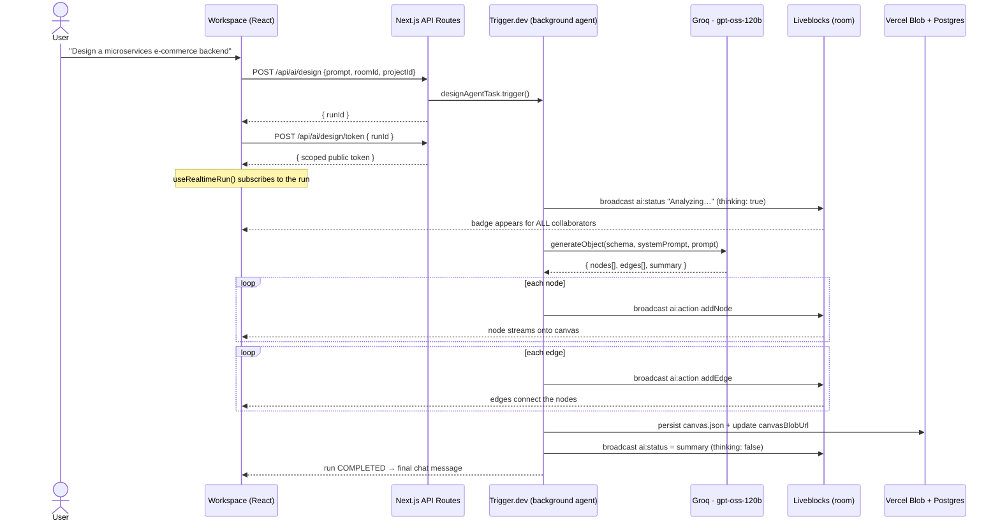

### What makes this hard (and interesting)

- **The AI speaks the canvas's native language.** The agent's LLM call is a *structured* generation: it returns a strict, schema-validated object of nodes and edges — each with a shape, a palette colour, coordinates, and a size — not prose. A detailed system prompt teaches the model the visual grammar of good architecture diagrams:

  | Shape | Represents | Palette hint |
  |-------|------------|--------------|
  | Rectangle | services, APIs, backends | blue |
  | Cylinder | databases, blob stores | emerald |
  | Pill | queues, event streams, caches | amber |
  | Diamond | load balancers, gateways, routers | violet |
  | Hexagon | microservices, third-party systems | cyan |
  | Circle | users, external actors | default |

- **Nodes stream in.** Rather than dumping the whole diagram at once, the agent broadcasts one `ai:action` event per node, then pauses, then wires the edges — so collaborators watch the diagram *assemble itself*.

- **AI edits and human edits share one CRDT.** When an `addNode` event arrives, the client doesn't write to some separate "AI layer." It dispatches the node through the **exact same `onNodesChange` path** a human drag-and-drop uses, so `@liveblocks/react-flow` wraps it as a conflict-free `LiveObject`. From that moment the AI's node is indistinguishable from a hand-drawn one — draggable, editable, and synced to every client.

---

## 3. System Architecture

The whole system at a glance — a Next.js app orchestrating five external services, each owning a clear slice of responsibility.

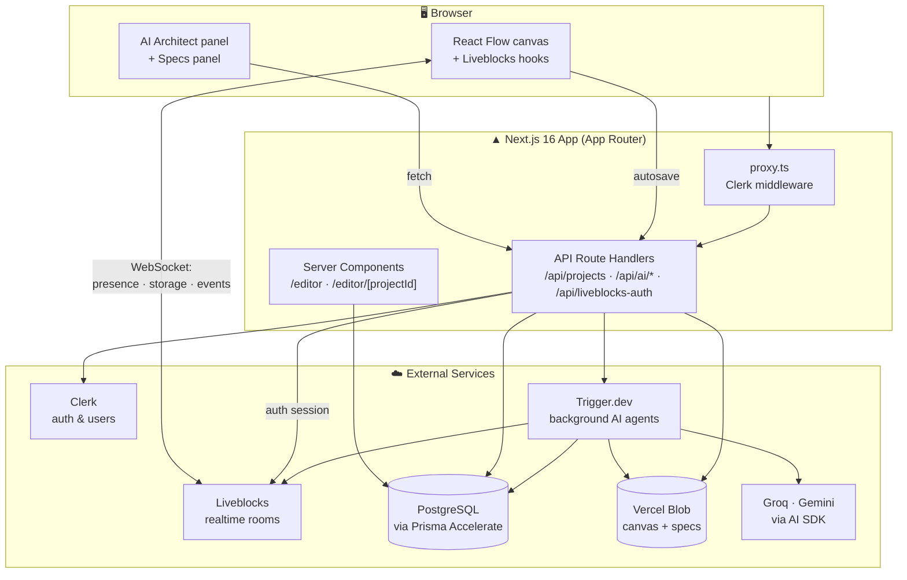

**Who owns what:**

| Layer | Technology | Responsibility |
|-------|-----------|----------------|
| Framework | Next.js 16 (App Router) + React 19 | Server components for data loading, route handlers as the API, client components for the interactive editor |
| Auth | Clerk | Sign-in/up, sessions, user profiles; enforced in `proxy.ts` middleware |
| Realtime | Liveblocks | Multiplayer presence, live cursors, and the shared canvas CRDT; delivers AI events |
| Canvas | React Flow | Node/edge rendering, dragging, connecting, viewport |
| Background AI | Trigger.dev | Durable, retryable agent runs (design + spec generation) |
| LLMs | AI SDK v6 → Groq / Gemini | Structured diagram generation & Markdown spec generation |
| Database | Prisma 7 + PostgreSQL | Project metadata, collaborators, run records, spec records |
| Blob storage | Vercel Blob | Canvas JSON snapshots and generated spec files |

> **A note on Next.js 16:** middleware lives in `proxy.ts` (Next.js 16 renamed the `middleware` convention to `proxy`). The app is built against a pre-release Next.js where a few App Router conventions differ from older majors.

---

## 4. The Collaborative Canvas

The canvas is the heart of the product — a React Flow surface whose entire state lives in a Liveblocks room, so every stroke is instantly shared.

### Shared state model

A Liveblocks room holds three pieces of storage plus per-user presence:

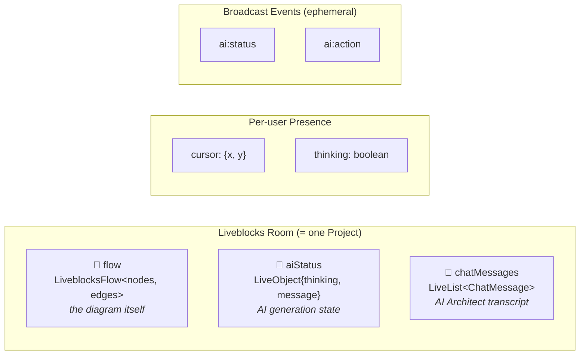

- **`flow`** — the nodes and edges, as a conflict-free CRDT. Two people (or a person and the AI) can edit simultaneously without clobbering each other.
- **`aiStatus`** — a persisted `LiveObject` so that even someone who joins *mid-generation* immediately sees "Polaris is designing…".
- **`chatMessages`** — the AI Architect conversation, shared so collaborators see the same prompt history.
- **Presence** carries each user's live cursor position and a `thinking` flag (which drives a little spinner on their cursor badge while the AI works on their behalf).
- **Broadcast events** (`ai:status`, `ai:action`) are the ephemeral wire the background agent uses to push updates into the room.

### What the canvas can do

A full diagramming toolkit was built out over the project's feature history:

- **Six node shapes** (rectangle, circle, diamond, pill, cylinder, hexagon) rendered via CSS + SVG, drag-dropped from a floating shape panel.
- **In-place editing** — double-click to rename, drag handles to resize (`NodeResizer`), a colour-swatch toolbar with a curated 7-colour palette.
- **Smart edges** — right-angle smooth-step connectors with editable pill labels and four connection handles per node.
- **Ergonomics** — zoom/fit/undo/redo controls, keyboard shortcuts (that correctly ignore keystrokes while you're typing in a label), a minimap, and dot-grid background.
- **Presence layer** — overlapping collaborator avatars and coloured live cursors with name badges.
- **Starter templates** — three ready-made diagrams (Microservices, CI/CD pipeline, Event-driven system) importable in one click, previewed as pure-SVG thumbnails.

---

## 5. Under the Hood — The Realtime Collaboration Layer

Before anyone can touch a room, they have to be authorized for it. Polaris mints Liveblocks sessions server-side, tied to Clerk identity and project access.

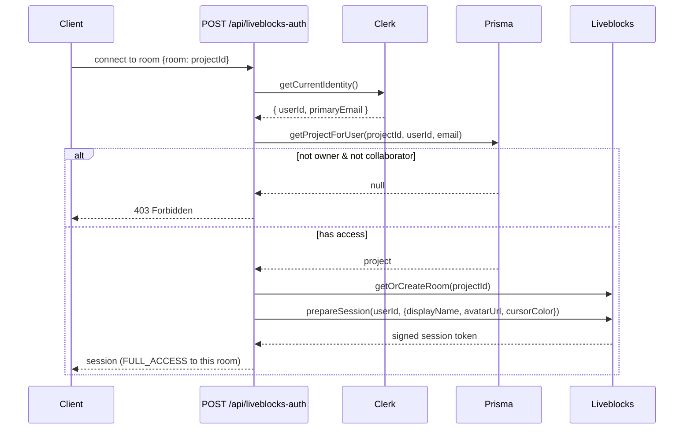

The session is stamped with the user's display name, avatar, and a **deterministic cursor colour** (a stable hash of their user ID over a 10-colour palette) — so a given person is always the same colour to everyone, across sessions.

---

## 6. The AI Design Agent (Deep Dive)

The design agent is a **Trigger.dev background task**, not an inline request handler. That choice is deliberate and drives the whole design.

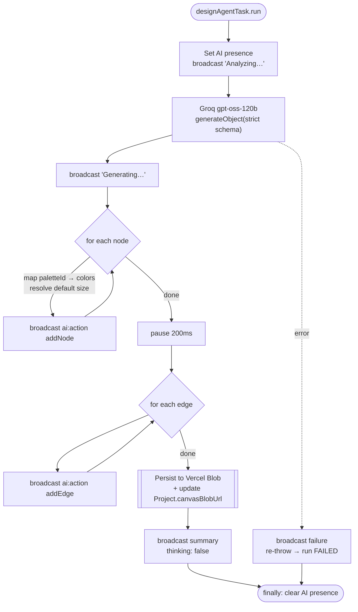

**Why background, not inline?**

- **Durability.** The agent writes the finished diagram straight to Vercel Blob and updates the project record *inside the task*. If the user closes the tab mid-generation, the diagram is still there when they return — it's loaded from blob on next open. The live broadcast is a bonus, not a requirement.
- **Retries & timeouts.** Trigger.dev gives the run automatic exponential-backoff retries (3 attempts) and a 300-second budget, isolated from the request/response cycle.
- **No long-lived HTTP.** The API route returns a `runId` in milliseconds; the browser subscribes to progress over a separate realtime channel.

### Secure progress streaming

How does the browser watch a background run without holding a privileged secret? **Scoped, single-run tokens.**

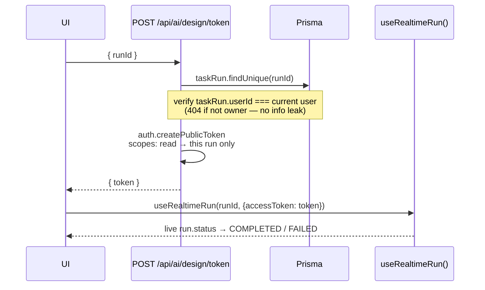

Every run is recorded as a `TaskRun` row keyed to the user who launched it. The token endpoint refuses to mint a token for a run you don't own, and the token it *does* mint can only **read that one run** — nothing else in the Trigger.dev project is reachable from the client.

> **A word on model choice:** the agent uses Groq's `openai/gpt-oss-120b` because structured-output support (`json_schema` mode) is *model-specific*, not provider-wide — and this model enforces the Zod schema strictly. Gemini has excellent schema support but its free tier's rate limits are too tight for iterative work, so it's reserved for the spec generator (below), where freeform Markdown is the output.

---

## 7. Spec Generation — From Diagram to Document

The second AI capability turns a finished diagram (plus the AI Architect chat history) into a written **technical specification** in Markdown.

```mermaid
flowchart LR
    Btn["Generate Spec button"] --> Post["POST /api/ai/spec<br/>{roomId, chatHistory, nodes, edges}"]
    Post --> Access["resolve project access<br/>(projectId never trusted from client)"]
    Access --> Trigger["generateSpecTask.trigger()"]
    Trigger --> Gemini["Gemini 2.0 Flash<br/>generateText → Markdown"]
    Gemini --> BlobUp["upload to Vercel Blob<br/>(private)"]
    BlobUp --> Record["ProjectSpec row<br/>{projectId, filePath}"]
    Record --> List["Specs tab lists · previews · downloads"]
```

The Specs tab fetches the project's spec history, renders any spec in a modal with `react-markdown`, and offers download via an authenticated fetch (so private blobs never require a public URL). Like the design agent, spec generation is a durable Trigger.dev run tracked with the same scoped-token realtime pattern.

---

## 8. Autosave & Persistence

The canvas continuously saves itself without a "Save" button (though there's a status pill in the navbar showing *Saving / Saved / Retry*).

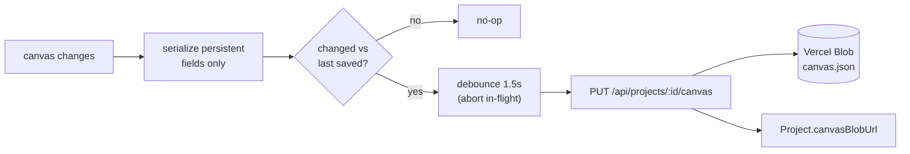

Three details that make it robust:

- **It serializes only the *persistent* shape of each node/edge** (id, position, data, size) — React Flow's ephemeral fields (`selected`, `dragging`, `measured`) never trigger a save, so idle selection changes don't spam the server.
- **A load baseline prevents an echo save** — the just-loaded state is captured as the reference, so hydration doesn't immediately re-POST.
- **In-flight requests are aborted** via `AbortController` when a newer save fires, so only the latest snapshot ever lands.

On open, the canvas hydrates from the saved blob — which is also exactly where the AI design agent writes — so an AI-generated diagram appears on load even if it was created while no browser was connected.

---

## 9. Authentication & Access Control

Clerk handles identity; the app enforces a simple, strict ownership model.

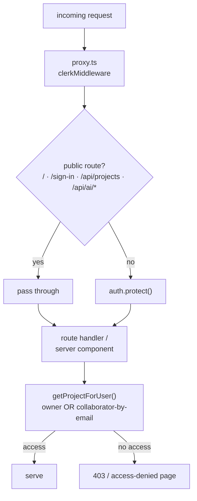

- **Protected-by-default.** The middleware protects everything except an explicit allow-list. API routes are on the public list because they do their *own* auth-in-handler check (returning JSON `401`s rather than HTML redirects) — a cleaner contract for the client.
- **Owner + collaborators.** Every project has one owner (a Clerk user ID). Others get access by having their **email** added as a collaborator. Server-side `getProjectForUser` gates every project read/write on "owner or invited collaborator."
- **No client-trusted authority.** IDs like `projectId` are re-resolved from the authenticated session on the server — never taken at face value from the request body.

---

## 10. Data Model

Four Prisma models back the whole app. Collaboration is intentionally email-based (invite before the person even has an account); AI runs and specs are tracked in their own tables.

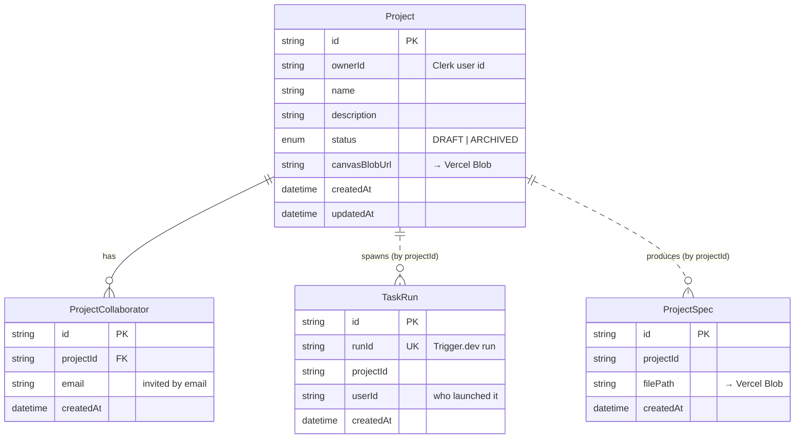

**A split-storage strategy:** the database holds *metadata and pointers*; the heavy content (canvas JSON, spec Markdown) lives in Vercel Blob, referenced by URL. This keeps rows small and query-fast while large documents scale independently.

---

## 11. Tech Stack

| Category | Choices |
|----------|---------|
| **Framework** | Next.js 16.2 · React 19.2 · TypeScript 5 |
| **Styling** | Tailwind CSS v4 · shadcn/ui · Radix primitives · lucide-react icons · Geist fonts · dark theme |
| **Canvas** | `@xyflow/react` (React Flow) 12 |
| **Realtime** | Liveblocks 3 — `client` · `react` · `react-flow` · `node` · `react-ui` |
| **Background jobs** | Trigger.dev 4.5 (`@trigger.dev/sdk`, `@trigger.dev/react-hooks`) |
| **AI** | Vercel AI SDK v6 · `@ai-sdk/groq` (design) · `@ai-sdk/google` (specs) |
| **Auth** | Clerk (`@clerk/nextjs` 7, `@clerk/ui`) |
| **Database** | Prisma 7 · PostgreSQL · Prisma Accelerate · `@prisma/adapter-pg` |
| **Storage** | Vercel Blob |
| **Validation** | Zod 4 |

---

## 12. Engineering Highlights

A few problems that were genuinely non-trivial to get right:

- **AI and humans on one CRDT.** AI-generated nodes flow through the same React Flow change pipeline as human edits, so Liveblocks wraps them as conflict-free `LiveObject`s. The AI isn't a special case — it's just another collaborator writing to shared storage.

- **Durable-first AI.** By persisting the diagram to blob storage *inside* the background task, generation succeeds regardless of whether a browser is connected. Real-time streaming layers on top for delight, but correctness never depends on a socket being open.

- **Least-privilege realtime tokens.** Clients watch background runs with per-run, read-only tokens verified against a `TaskRun` ownership record — the powerful server key never leaves the backend.

- **Prisma Accelerate's DDL split.** The runtime client talks to Postgres through Accelerate's HTTP proxy (connection pooling, edge-friendly), but Accelerate's role has no schema-modification rights — so migrations run against a *direct* database URL. Recognizing and separating these two connection paths was a real gotcha to unwind.

- **Structured-output model selection.** Reliable schema-constrained generation depends on the *specific* model, not just the provider. The agent settled on Groq's `gpt-oss-120b`, with a strict Zod schema (every field required; optionals modelled as `nullable`) to satisfy strict JSON-schema mode.

---

## 13. How It Was Built

Polaris was developed as a disciplined, **spec-driven sequence of ~29 features**, each one scoped, specified, implemented, type-checked, and recorded before the next began — from the design system and auth, through the collaborative canvas, up to the AI design agent and spec generator. That workflow log (in `context/progress-tracker.md`) doubles as a detailed engineering diary of every decision and trade-off along the way.

The feature arc, at a glance:

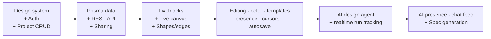

---

*This document describes the Polaris application. Source of truth for the running system is the code under `app/`, `components/`, `trigger/`, `lib/`, and `prisma/`.*
